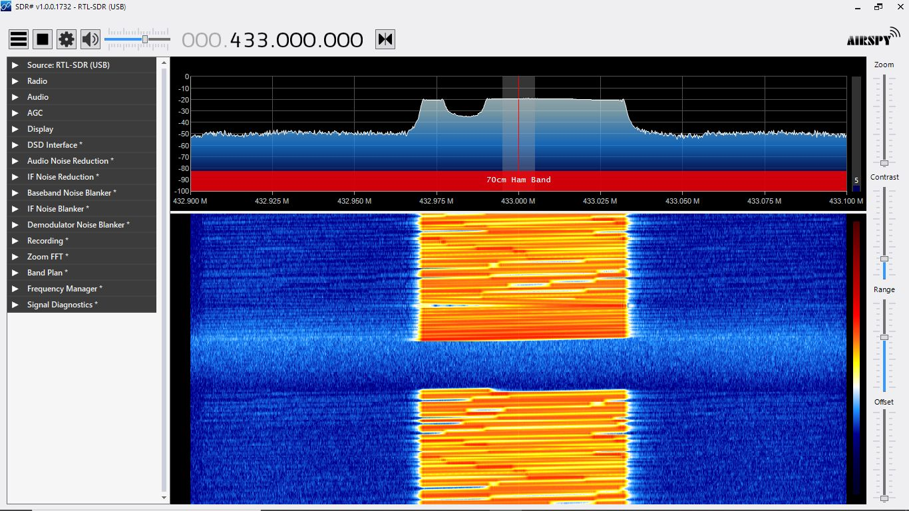
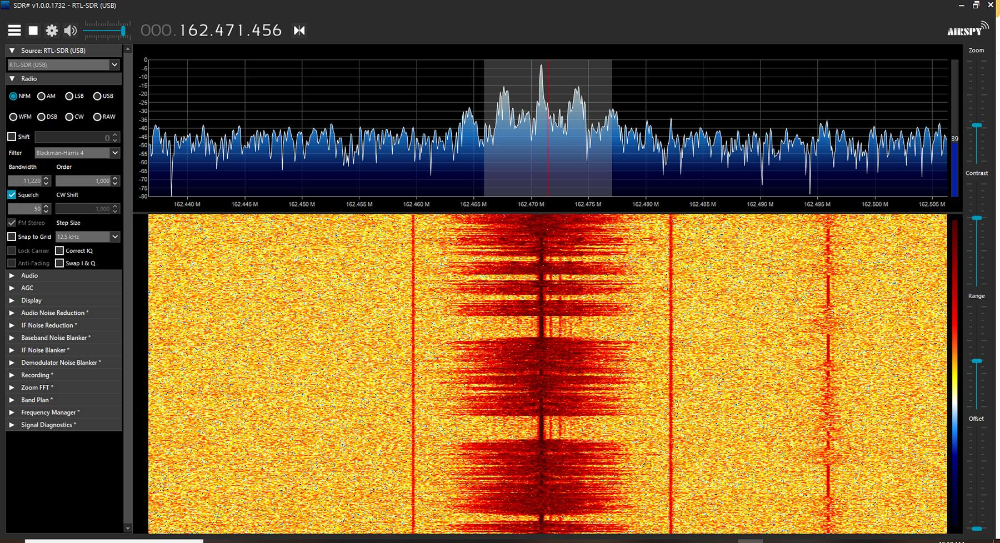

# Image Cassification And Processing

## RF Signal Classification using RTL-SDR and Deep Learning

### Project Overview
In this project, we aim to leverage Software-Defined Radio (SDR) - RTL-SDR, for real-time RF signal classification using deep learning techniques. The project involves capturing RF signals, transforming them into waterfall images, and training a deep learning model for image classification.

### Data Acquisition
#### SDR Setup
- RTL-SDR configuration for signal reception.
- Selection of frequency range and sampling rate.

#### Waterfall Transformation
- Conversion of time-domain signals into spectrograms or waterfall images.

### Dataset Creation
- Identification of signal types/categories for classification.
- Labeling of waterfall images based on signal categories.
- Creation of a diverse and representative dataset.

### Image Preprocessing
- Techniques for preprocessing waterfall images (resizing, normalization, etc.).
- Ensuring consistency and enhancing the quality of the dataset.

### Deep Learning Model
- Preferred Library for training the model - pytorch
- Selection or design of a deep learning model (e.g., Convolutional Neural Network - CNN using Encoder Decoder Model).
- Training the model on the labeled dataset.
- Evaluation metrics and validation of the model's performance.

### Real-Time Implementation
- Integration of the trained model into a real-time system.
- Streaming data from RTL-SDR to the model for continuous inference.
- Computational resource considerations and efficiency in real-time processing.

### Application and Interpretation
- Practical applications of the classification results.
- Visualization and interpretation of the classified results.

### User Interface or Reporting System
- Development of a user interface or reporting system.
- Presentation of classified results in a user-friendly manner.
- Options for visualizations, logs, or notifications.

### Fine-Tuning and Optimization
- Continuous monitoring of model performance in real-world conditions.
- Fine-tuning the model based on feedback and experience.
- Optimization for efficiency, especially for real-time processing.

